# Bit Manipulation

## Decimal to Binary

```cpp
string toBinary(int x) {
    string ans = "";
    while (x > 0) {
        if (x % 2 == 1) ans = '1' + ans; //if you are doing ans + ' 1' you need to reverse the string at the end
        else ans = '0' + ans;
        x /= 2;
    }
    return ans.empty() ? "0" : ans;
}
```

## Binary to Decimal

```cpp
int toDecimal(string str) {
    int n = str.size();
    int ans = 0;

    int i = 0;
    while (n > 0) {
        ans = ans + (str[n-1] - '0') * pow(2, i); //conversion to int
        i++;
        n--;
    }
    return ans;
}
```

## Storages
Int takes 4 bytes, 32 bits
Char takes 1 byte, 8 bits
Float takes 4 bytes, 32 bits
Double takes 8 bytes, 64 bits
long long takes 8 bytes, 64 bits

## Operators

Types of operators:
1. Bitwise AND (&)
2. Bitwise OR (|)
3. Bitwise XOR (^)
4. Bitwise NOT (~)
5. Left Shift (<<)
6. Right Shift (>>)

## Bitwise AND

if both bits are 1, then the result is 1, else 0

## Bitwise OR

if any of the bits is 1, then the result is 1, else 0

## Bitwise XOR

if both bits are different, then the result is 1, else 0

number of 1s -> odd -> 1
number of 1s -> even -> 0

## Right Shift

Divide the number by 2
13 >> 1 = 6
13 >> 2 = 3 why? 13/2 = 6, 6/2 = 3

x>>k = x/(2^k)

## How computers store positive and negative numbers

intger takes 32 bit and the leftmost bit is the sign bit
0 -> positive
1 -> negative

and how this is processed ? -> using 2's complement

largest positive number = 2^31 - 1
smallest negative number = -2^31 

<image>

## Left Shift

Multiply the number by 2
13 << 1 = 26
13 << 2 = 52 why? 13*2 = 26, 26*2 = 52

x<<k = x*(2^k)

## Bitwise NOT (~)

1 -> 0
0 -> 1

### Working of ~

1. Flip the bits -> 0 -> 1, 1 -> 0
2. if the number is negative, then add 1 to the number (2's complement)
3. if the number is positive store the number as it is


# Problems

## Swap two numbers without using a temporary variable

using XOR

```cpp
void swap(int &a, int &b) {
    a = a ^ b;
    b = a ^ b;
    a = a ^ b ;
}
```
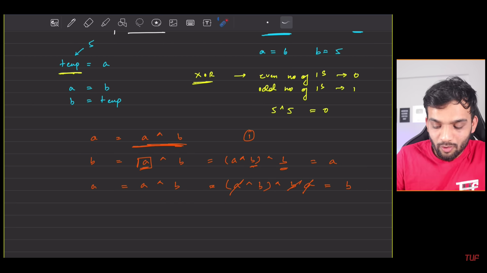

## Check if the ith bit is set or not
what do i mean by the bit being set or not?
if the ith bit is 1, then the bit is set
if the ith bit is 0, then the bit is not set
example -> 13 -> 1101 -> 1st, 3rd and 4th bit is set

### Approach 1
1. Take the number and then convert it to binary
2. check if the ith bit is 1 or 0, and return the answer

### Approach 2
using the left shift operator

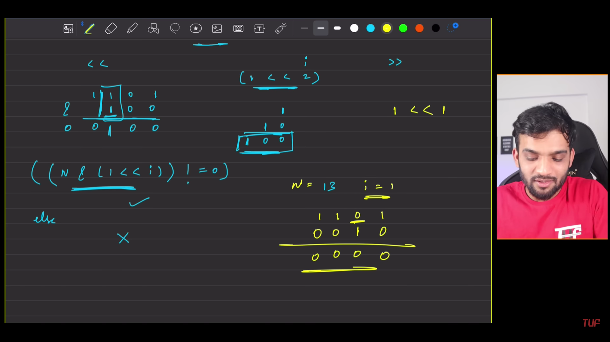

syntax: (n & (1 << i)) != 0 then set else not set

```cpp
bool checkBit(int n, int i) {
    return (n & (1 << i)) != 0;
}
```

### Approach 3
using the right shift operator

syntax: (n >> i) & 1

```cpp
bool checkBit(int n, int i) {
    return (n >> i) & 1;
}
```
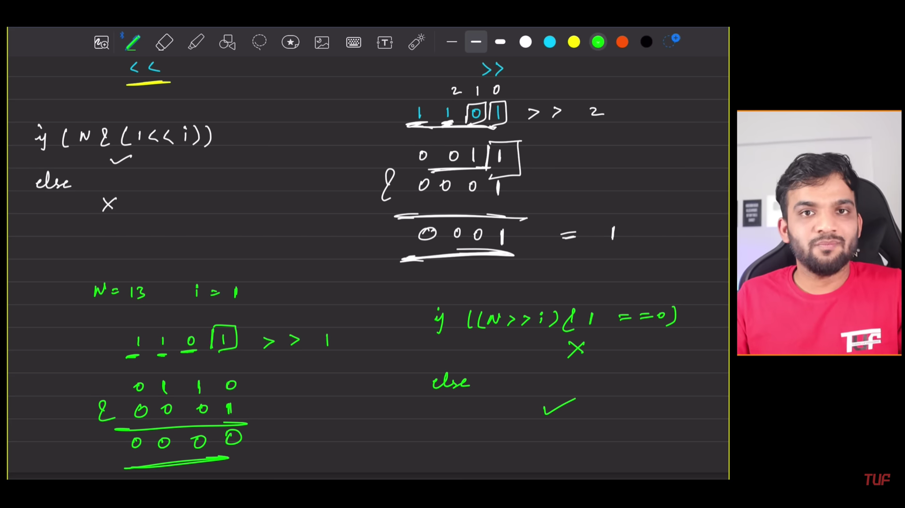

## Set the ith bit

### Approach 1
using the left shift operator

syntax: n = n | (1 << i)

```cpp
int setBit(int n, int i) {
    return n | (1 << i);
}
```

```
dry run
n = 13 -> 1101
i = 1
1 << i = 10
n | (1 << i) = 1101 | 10 = 1111
```
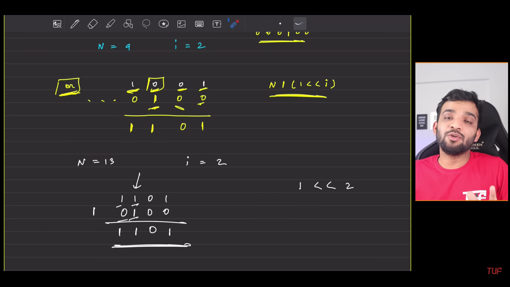


## Unset/clear the ith bit

### Approach 1
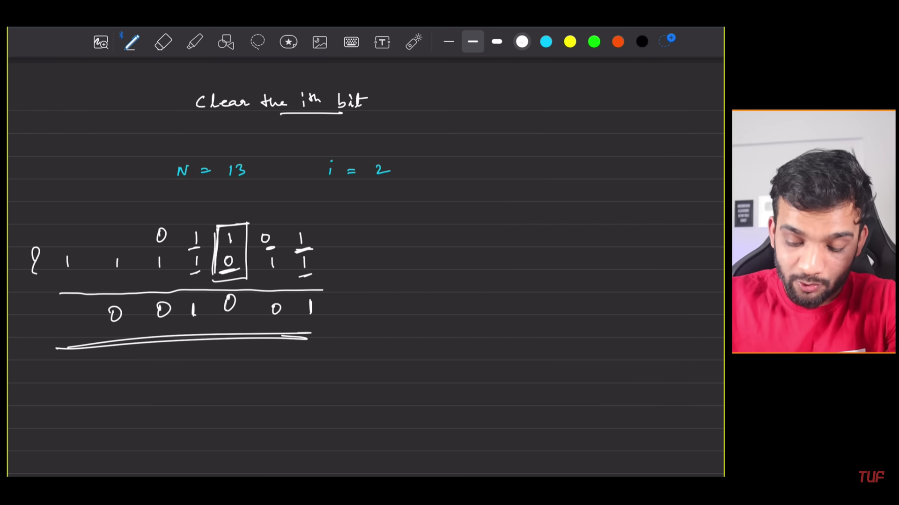
i somehow need to put 0 at the ith position

steps to do it
1. let's take 1 and then left shift it by i times
2. then take the complement of it, because we need to put 0 at the ith position
3. then take the AND of the number and the complement of the number

syntax: n = n & ~(1 << i)

```cpp
int unsetBit(int n, int i) {
    return n & ~(1 << i);
}
```

```
dry run
n = 13 -> 1101
i = 1
1 << i = 10
~(1 << i) = 01
n & ~(1 << i) = 1101 & 01 = 1101 & 01 = 1101
```

## Toggle the ith bit

you need to toggle no clear, toggle means inverting the value of the bit

### Approach 
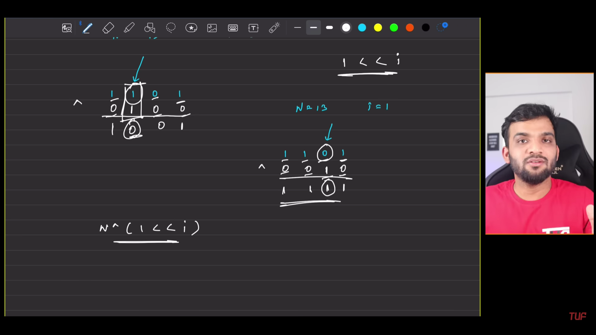

syntax: n = n ^ (1 << i)

```cpp
int toggleBit(int n, int i) {
    return n ^ (1 << i);
}
```

``` 
dry run
n = 13 -> 1101
i = 1
1 << i = 10
n ^ (1 << i) = 1101 ^ 10 = 1111
```

## Remove the rightmost set bit
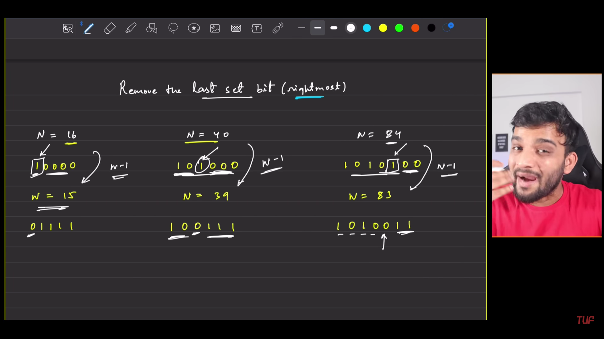

syntax: n = n & (n-1)

```cpp
int removeRightmostSetBit(int n) {
    return n & (n-1);
}
```

```
dry run
n = 13 -> 1101
n-1 = 12 -> 1100
n & (n-1) = 1101 & 1100 = 1100
```

## Check if the number is power of 2

charateristics of the number which is power of 2 -> it has only 1 bit set

### Approach 
1. if i remove the rightmost set bit, then the number will be 0
2. if the number is power of 2, then the number will be 0

syntax: n & (n-1) == 0

```cpp
bool isPowerOf2(int n) {
    return n && !(n & (n-1));
}
```

```
dry run
n = 16 -> 10000
n-1 = 15 -> 01111
n & (n-1) = 10000 & 01111 = 0
```

## Count the number of set bits

there is no direct formula to count the number of set bits

### Approach 1
1. take the number and then convert it to binary
2. count the number of 1s
    
```cpp

i will do it in a while
```

```cpp
int countSetBits(int n) {
    int count = 0;
    while (n > 0) {
        count += n & 1; // checking for odds -> n%2
        n = n >> 1; // n = n/2
    }
    return count;
}
```

```
### Approach 2
1. use inbuilt function

```cpp
int countSetBits(int n) {
    return __builtin_popcount(n);
}
```

## Divide two numbers without using the division operator

### Approach 1
1. keep subtracting the divisor from the dividend until the dividend is greater than the divisor
2. keep a count of how many times you have subtracted the divisor from the dividend

```cpp
int divide(int dividend, int divisor) {
    int sign = (dividend < 0) ^ (divisor < 0) ? -1 : 1;
    long long int a = abs(dividend);
    long long int b = abs(divisor);
    long long int ans = 0;
    while (a >= b) {
        a -= b;
        ans++;
    }
    return sign * ans;
}
```

### Approach 2
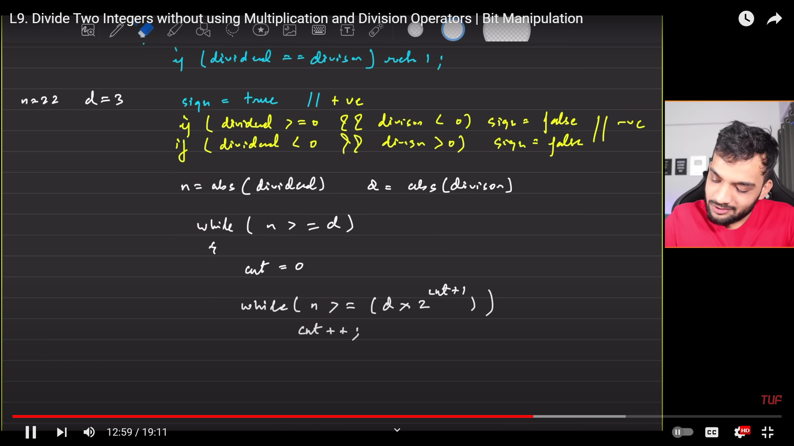


approach
1. keep subtracting the divisor*2^i from the dividend until the dividend is greater than the divisor
2. keep a count of how many times you have subtracted the divisor*2^i from the dividend
3. add the count to the answer
4. keep doing this until the dividend is greater than the divisor
5. return the 2^i as the answer


```cpp


got TLE in this one because i was updating a and b inside second while loop but we need to count only in that loop

```cpp

int division(int a, int b){
    if(a == b){
        return 1;
    }
    // sign
    bool sign = false; // positive

    if(a<0 && b>0){
        sign = true; //negative
    } else if(a>0 && b<0){
        sign = true; // negative
    }
    a = abs(a);
    b = abs(b);
    int ans = 0;
    // base case
    while(a>=b){
        int count = 0;

        while ((b << (count + 1)) <= a) {
            count++;
        }
            // ans = ans + pow(2, count); // can be written as
            ans = ans + (1<<count);
            a = a - (b*(1<<count));
    }

    if (sign == true){
        ans = -ans;
    }
    return ans;
}
```


```cpp

class Solution {
public:
    int divide(int dividend, int divisor) {
        if(dividend==divisor)
            return 1;
        bool sign = true;
        if((dividend<0 && divisor>0) || (divisor<0 && dividend>=0))
            sign = false;
        unsigned int n = abs(dividend);
        unsigned int d = abs(divisor);
        unsigned int ans = 0;
        while(n>=d){
            short count=0;
            while(n > (d<<(count+1)))
                count++;
            ans += (1<<count);
            n = n - (d*(1<<count));
        }
        if(ans == (1<<31) and sign)
            return INT_MAX;
        return (sign?(ans):(-1*(ans)));
    }
};
```


## Minimum Bit Flips to Convert Number

using xor because it tells us the difference in the bits

```cpp
class Solution {
public:
    int minBitFlips(int start, int goal) {
        return __builtin_popcount(start^goal);
    }
};
```

### How this will work
1. if the bits are different, then the xor will be 1
2. if the bits are same, then the xor will be 0
3. so, the number of 1s in the xor will be the number of bits that are different and we will count those bits, because bullitin_popcount will count the number of 1s in the xor


## Find the element that appears once in an array where every other element appears twice

using xor we can do this

```cpp
class Solution {
public:
    int singleNumber(vector<int>& nums) {
        int ans = 0;
        for (int i = 0; i < nums.size(); i++) {
            ans = ans ^ nums[i];
        }
        return ans;
    }
};
```

## Powerset of the given array
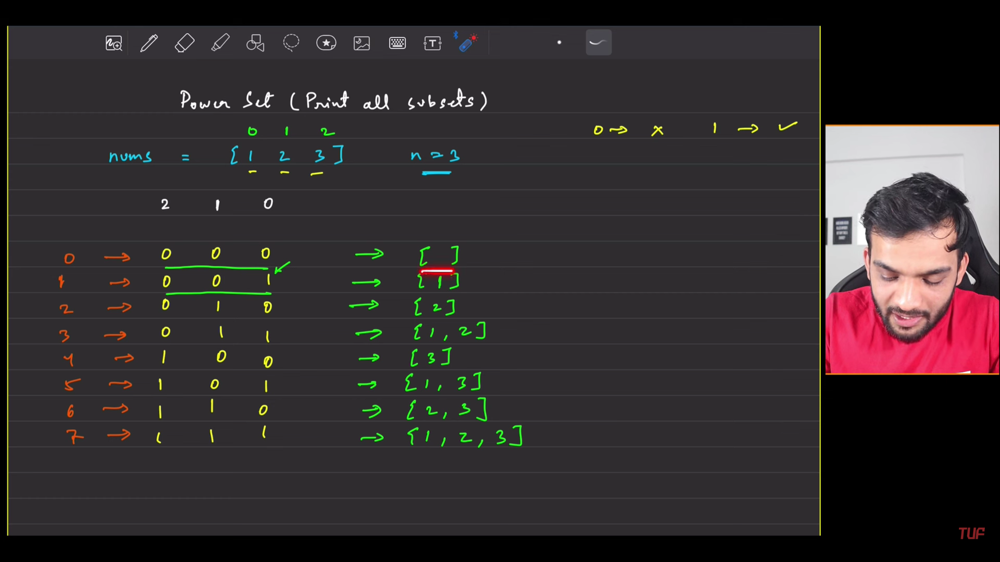
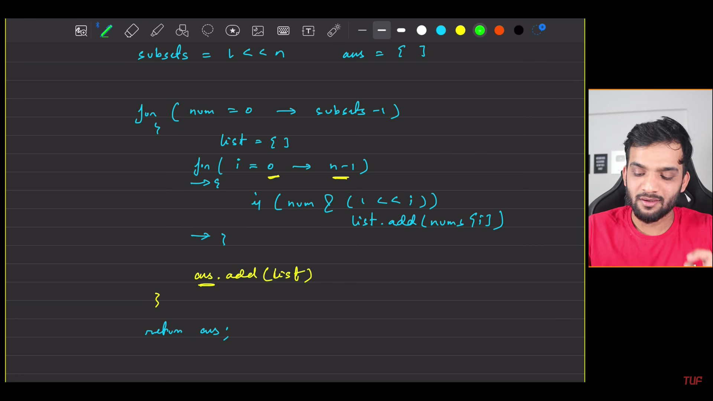
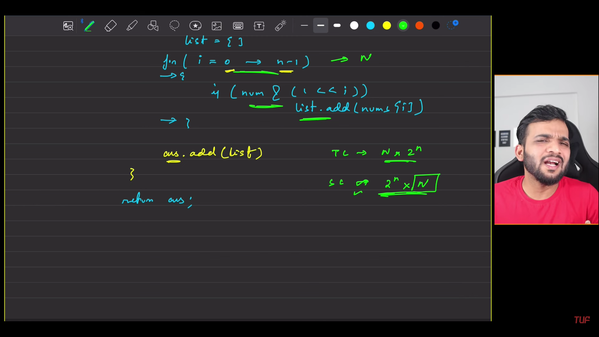


