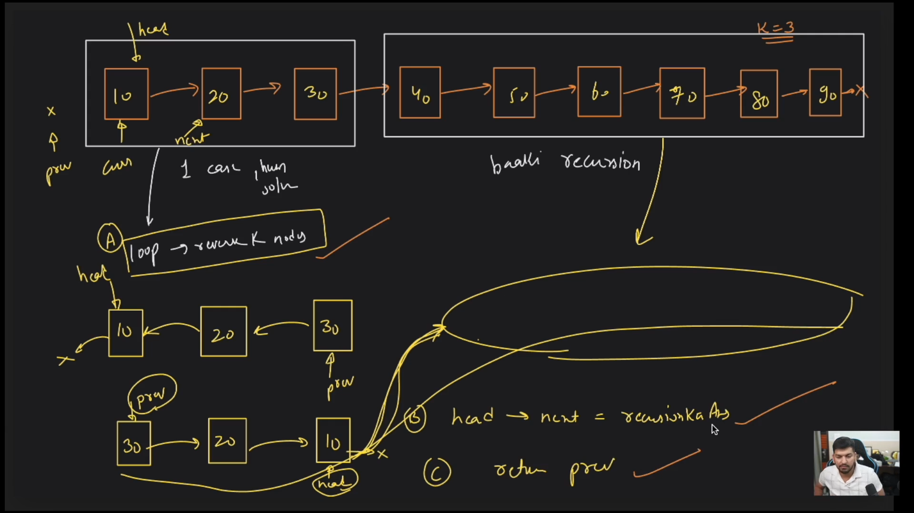
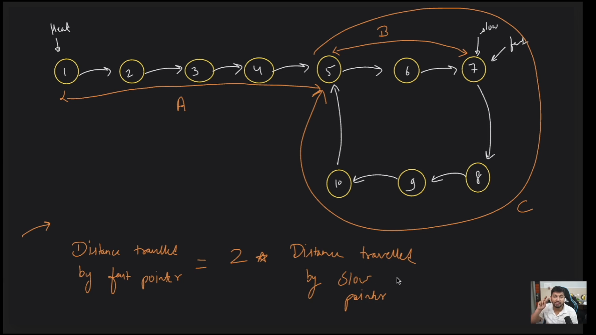
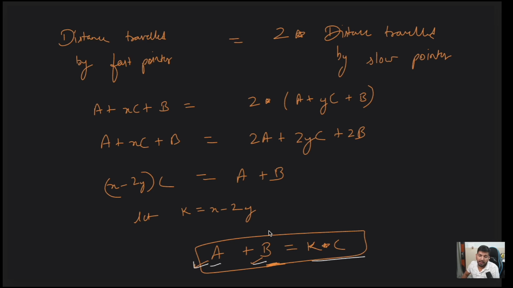
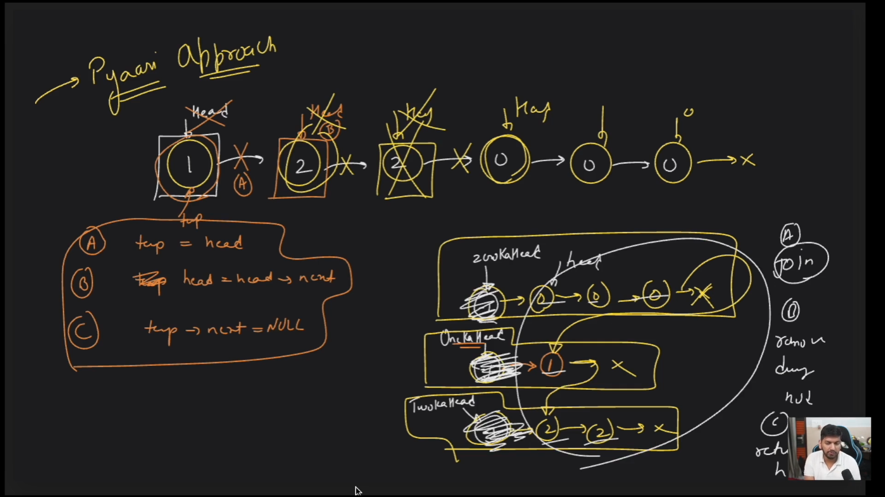

# The core concept
linkedlist is a data structure that is used to store data in a linear way. It is a collection of nodes where each node contains a data field and a reference(link) to the next node in the sequence. The first node is called the head and the last node is called the tail. The tail node points to null.

## Why we need linked list?
because as we now that the array is a data structure that stores the data in the contagious memory location. so let's suppose we have free memory of size 10 mb (but it is not continous, it is fragemented) and the data we wants to store will take the same size that is 10 mb but still we can't store it because the memory is not contagious

similarly with vectors because they are nothing but dynamic __arrays__, also the memory wastage is also there because it double it's size once completely filled and rest of the memory spaces stays empty if we don't fill data in it


__LinkedList__ stores the data in the non-contigious memory locations unlike the array

## Operations in Linked List
1. Insertion : 
    - Insertion at the beginning : O(1)
    - Insertion at the end : O(n)
    - Insertion at the middle : O(n)
2. Deletion 
    - Deletion at the beginning : O(1)
    - Deletion at the end : O(n)
    - Deletion at the middle : O(n)
3. Traversal : O(n)
4. Searching : O(n)
5. Sorting : O(n^2)
6. Merging : O(n)
7. Reversing : O(n)

_Simple Linkedlist_ - visualisation

```
    head -> |data|next| -> |data|next| -> |data|next| -> |data|next| -> |data|next| -> null
```
### Creation of a node
singly linkedlist
```cpp
class node{
    public:
    int data;
    node* next; //  pointer is of node type or node data structure
}
```

## Types of Linked List

1. Singly Linked List : 
how it looks like
```
    head -> 1 -> 2 -> 3 -> 4 -> 5 -> null
```
each node contains the data and the reference to the next node
2. Doubly Linked List
how it looks like
```
    null <- 1 <-> 2 <-> 3 <-> 4 <-> 5 -> null
```
each node contains the data and the reference to the next and previous node
3. Circular Linked List
how it looks like
```
    head -> 1 -> 2 -> 3 -> 4 -> 5 -> head
```
the last node points to the head node, so it makes a circle.
4. Circular Doubly Linked List
how it looks like
```
    head <-> 1 <-> 2 <-> 3 <-> 4 <-> 5 <-> head
```

# Note ( some hacks and important things)

agr loop ki condition `node!= null` hogi then we will reach till the out of the linkedlist once the loop is over 

if the condition is `node->next != null` then we will reach till the last node

whenever we need to make a node NULL we will equate it to NULL or the NULLED Node, if you want just the link to be NULL then you need to do `node->next = NULL`

Don't forget to update the temp pointer in the Loop

Whenever you need to make any changes pass the head by reference

## Creation of the LinkedList
```cpp
void createNode(node*& head, int n) {
    int count = 1;
    while (count <= n) {
        int val;
        cout << "Enter the value for node " << count << endl;
        cin >> val;
        node* newNode = new node(val);
        if (head == nullptr) {
            head = newNode;
        } else {
            node* temp = head;
            while (temp->next != nullptr) {
                temp = temp->next;
            }
            temp->next = newNode;
        }
        count++;
    }
}
```
## Traversal of the LinkedList
```cpp
void printList(node* head) {
    if (head == nullptr) {
        cout << "Can't print, the list is empty" << endl;
        return;
    }
    node* temp = head;
    while (temp != nullptr) {
        cout << temp->val << " ";
        temp = temp->next;
    }
    cout << endl;
}
```
## Insertion at the beginning
```cpp
void insertInBeginning (node* &head, int n){
    // if we want to insert a new node in the beginning
    node* temp = head;
    node* newNode = new node(n);
    head = newNode;
    newNode-> next = temp;
}
```
## Insertion at the end
```cpp
void insertAtEnd(node* head, int n){
    node* temp =head;
    node* newNode =  new node(n);
    while(temp!=nullptr){
        temp = temp->next;
    }
        temp->next = newNode;
}
```
## Insertion at a given position
```cpp
void insertAtPos(node* &head, int pos, int value){
    int count = 1;
    node* temp = head;
    node* next;
    node* newNode = new node(value);
    while(count != pos){ // iterate till the position given
    temp = temp->next;
    count ++;
    }
    next = temp->next;
    newNode-> next = next;
    temp->next = newNode;
}
```
## Deletion at the beginning
```cpp
void deleteFromPos(node* &head, int pos){
    node* temp;
    node* prev;
    int count = 1;
    temp = head;
    while(count!=pos){
        prev = temp;
        temp = temp->next;
    }
    prev->next = temp->next;

}
```
# Doubly Linked List

## Creation of the node
```cpp
class node{
    public:
    int val;
    node* prev;
    node* next;

    node(int x){
        this->val = x;
        this->prev = nullptr;
        this->next = nullptr;
    }

};
```
## Creation of the Doubly Linked List
```cpp
void createNode(node* &head, int n){
    int count = 1;
    node* temp;
    while(count!=n){
        int val;
        cout<<"Enter the value for "<<count<<" node"<<endl;
        cin>>val;
        node* newNode = new node(val);
        if(head == nullptr){
            head = newNode;
        }else{
            temp = head;
            while(temp->next!=nullptr){
                temp = temp->next;
            }
            temp->next = newNode;
            newNode->prev = temp;
        }
        count++;
    }
}
```
## Traversal of the Doubly Linked List
```cpp
void printList(node* head){
    if(head == nullptr){
        cout<<"The list is empty"<<endl;
        return;
    }
    node* temp = head;
    while(temp!=nullptr){
        cout<<temp->val<<" ";
        temp = temp->next;
    }
    cout<<endl;
}
```
## Insertion at the beginning
```cpp
void insertInBeginning(node* &head, int val ){
    node* newNode = new node(val);

    newNode->next = head;
    head ->prev = newNode;
    head = newNode;
}
```
## Insertion at the end
```cpp
void insertAtEnd(node* &head, int val){
    node* newNode = new node(val);
    node* temp;
    temp = head;
    while(temp->next != nullptr){
        temp = temp->next;
    }
    newNode->prev = temp;
    temp -> next = newNode;
}
```
## Insertion at a given position
```cpp
void insertAtPos(node* &head, int pos, int val){
    int count = 1;
    node* temp = head;
    node* next;
    node* newNode = new node(val);
    while(count != pos){
        temp = temp->next;
        next = temp->next;
        count++;
    }
    newNode->prev = temp;
    newNode->next = next;
    temp->next = newNode;

}
```
## Delete from position
```cpp
void deleteFromPos(node* &head, int pos){
    node* temp;
    node* prev;
    int count = 1;
    temp = head;
    if(head == nullptr){
        cout<<"Not Possible"<<endl;
    }
    while(count != pos){
        prev = temp;
        temp = temp->next;
        count ++;
    }
    prev->next = temp->next;
    temp->next->prev = prev;
}
```


# Problems

## Reverse the `k` Nodes

__Problem__ : Given a linked list, reverse the nodes of a linked list k at a time and return its modified list.

k is a positive integer. If the number of nodes is not a multiple of k then left-out nodes in the end should remain as it is.

if the nodes in the linked list is less than the value of `k` then don't reverse that part and return the list as it is

### Approach
1. First we will calculate the size of the linked list to check if we have appropriate number of nodes to reverse, if not we will return the head as it is
2. if we have sufficient number of codes we will reverse the first k given string in that scene after reversing our linkedlist will look something like this

__example__
LinkedList = 1 2 3 4 5 6 and k =2

```
after the first pass
|2|->|1|->|3|->|4|->|5|->|6|
```
previous pointer will be pointing too 2 and the or the curr pointer will be at 1 and next will be at 3

again we will check if the next is equal to `nullptr` or not if not we will give the recursive call




### Code

```cpp
int sizeOfList(node* head) {
    int count = 0;
    node* temp = head;
    while (temp != nullptr) {
        count++;
        temp = temp->next;
    }
    return count;
}

node* reverseKNodes(node* head, int k) {
    if (head == nullptr) {
        return nullptr;
    }

    int size = sizeOfList(head);
    if (k > size) {
        return head;
    }

    node* curr = head;
    node* next = nullptr;
    node* prev = nullptr;
    int count = 0;

    // Reverse first k nodes of the linked list
    while (curr != nullptr && count < k) {
        next = curr->next;
        curr->next = prev;
        prev = curr;
        curr = next;
        count++;
    }

    // Now next points to (k+1)th node
    // Recursively call for the list starting from current
    // And make rest of the list as next of first node
    if (next != nullptr) {
        head->next = reverseKNodes(next, k);
    }

    // prev is now head of the input list
    return prev;
}

```


## Detect a loop in the linked list (flyod's cycle detection algorithm)

Using fast and slow method

### Approach
1. We will declare one slow and fast pointer and initially both will be pointing to the head
2. The fast pointer will move 2 steps and the slow pointer will move 1 step
3. If the fast pointer and the slow pointer meet at any point then we can say that there is a loop in the linked list

### Code
```cpp
bool detectCycle(node* head){
    node* slow =head;
    node* fast= head;

    while(fast!=nullptr && fast->next != nullptr){
        fast = fast->next->next;
        slow = slow->next;

        if(slow == fast){
            return true;
        }
    }
    return false;
}
```

## Detect the starting point of the Loop



### Approach
1. Once slow and fast pointer meets, i.e the cycle is confirmed then we will reset the slow pointer to head and now each pointer will move one step
2. When again `slow == fast` then we that will be the starting point of the loop

### Code
```cpp
node* detectStart(node* head) {
    // Detecting the starting point of the loop
    node* slow = head;
    node* fast = head;

    // Detect if a cycle exists
    while (fast != nullptr && fast->next != nullptr) {
        fast = fast->next->next;
        slow = slow->next;

        if (slow == fast) {
            // Cycle detected, find the start of the cycle
            slow = head;
            while (slow != fast) {
                slow = slow->next;
                fast = fast->next;
            }
            return slow; // Start of the cycle
        }
    }

    return nullptr; // No cycle
}
```

## Remove the Loop in the LinkedList
The steps here will remain same like what we did in the starting point of the loop algorithm the only change here is that we will keep one previous pointer behing the fast variable and when both slow and fast meet the second time that means the starting point

we will do

```
previous->next = nullptr
```

```cpp
node* removeLoop(node* head) {
    node* slow = head;
    node* fast = head;
    node* prev = nullptr;

    // Detect the loop first
    while (fast != nullptr && fast->next != nullptr) {
        fast = fast->next->next;
        slow = slow->next;

        if (fast == slow) {
            // Loop detected
            slow = head;
            while (slow != fast) {
                prev = fast; // Update prev to the node before fast
                slow = slow->next;
                fast = fast->next;
            }
            prev->next = nullptr; // Remove the loop
            return head; // Return the modified list
        }
    }

    return head; // No loop in the list
}
```

## Check if the LinkedList is a Palindrome or not
### Approach
1. Linkedlist ka mid find out krege using slow and fast method
2. Mid ke aage ke saare elements ko reverese krdege LL main
3. We will compare from start and from mid->next till end, if all equal return true else false

### Code
```cpp
bool checkPalindrom(node* &head){
    node* slow = head;
    node* fast = head;

    // finding the mid
    while(fast!=nullptr && fast->next=nullptr){
        fast = fast->next;
        if(fast !=NULL){
            fast  = fast->next;
            slow = slow->next;
        }
    }
    // got the middle at slow
    // now we will reverse the values present after the mid, let's use iterative approach

    node* prev = slow;
    node* curr = slow->next;
    node* next;

    while(curr!=nullptr){
        next = curr->next;
        curr->next = prev;
        prev = curr;
        curr = next;
    }

    // compare the values now

    node* temp1;
    node* temp2;
    while(temp1<=slow && temp2!=nullptr){
        if(temp1->data != temp2->data){
            return false;
        }
        else{
            temp1 = temp1->next;
            temp2 = temp2->next;
        }
    }
    return true;
}

```
## Remove Duplicates from a sorted LinkedList

__Problem Statement__ -> Given a sorted linked list, delete all duplicates such that each element appears only once.

### Approach
1. We will take two pointers, one will be pointing to the current node and the other will be pointing to the next node
2. If the data of the current node is equal to the data of the next node then we will update the next pointer to the next of the next node, and the current node will point to the new next node skipping the duplicate node
3. If the data is not equal then we will move the current pointer to the next node


### Code
```cpp
node* removeDuplicates(node* head) {
    node* next = nullptr;
    node* curr = head;
    while(curr!=nullptr && curr->next !=nullptr){
        next = curr->next;
        if(curr->data == next->data){
            next = next->next;
            curr->next = next;
        }else{
            curr = curr->next;
        }
    }
    return head;
}node* removeDuplicates(node* head) {
    node* next = nullptr;
    node* curr = head;
    while(curr!=nullptr && curr->next !=nullptr){
        next = curr->next;
        if(curr->data == next->data){
            next = next->next;
            curr->next = next;
        }else{
            curr = curr->next;
        }
    }
    return head;
}
```


## Sort 0s, 1s and 2s in a LinkedList

__Problem Statement__ -> Given a linked list of 0s, 1s, and 2s, sort it.

### Approach 1
1. We will count the number of 0s, 1s, and 2s in the linked list
2. Then we will update the data of the nodes in the linked list according to the count of 0s, 1s, and 2s, but the interviewer can ask you not to manipulate the data of the nodes

### Approach 2
1. We will create three dummy nodes, one for 0s, one for 1s, and one for 2s
2. We will traverse the linked list and update the next of the dummy nodes according to the data of the current node
3. At the end, we will connect the three dummy nodes and remove the extra data we had in the dummy nodes just for the sake of creating them



