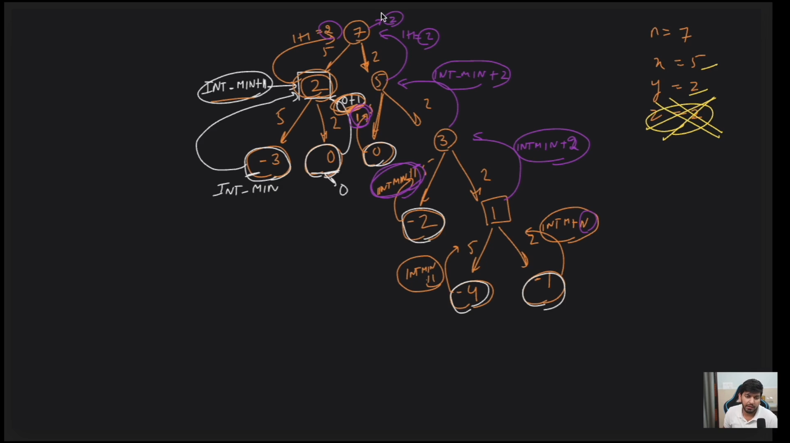
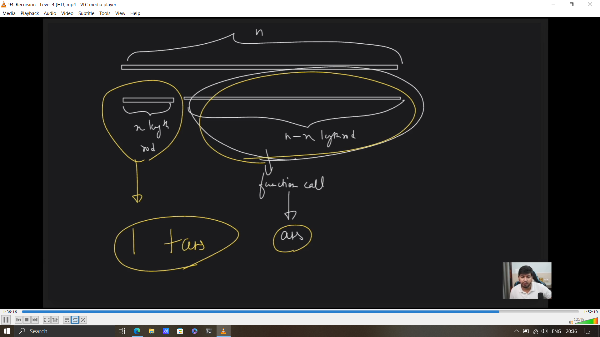

## Leval sabke niklege

how to find, what to return in basecase?
look at the function and observe what the functions gives output of, and then you need to return the value of that output in the basecase


## Find the min subsequences with the given sum

__Problem Statement__ -> Given an array of integers, find the minimum number of subsequences with the given sum  
__approach__ -> 


__solution code__

```cpp

#include <bits/stdc++.h>
using namespace std;
int solve (int arr[], int target){
    if(target == 0) {
        return 0;
    }
    if(target < 0){
        return INT_MAX;
    }

    int mini = INT_MAX;
    for(int i = 0; i < sizeof(arr)/sizeof(arr[0]); i++){
        int temp = solve(arr, target - arr[i]);
        if(temp != INT_MAX){
            mini = min(mini, temp + 1);
        }
    }
    return mini; // minimum number of coins to make this digit
}
int main(){
    int arr[] = {2,3};
    int target = 12;
   cout<< solve(arr, target)<<endl;
    return 0;
}
```



```cpp
#include <iostream>
#include<vector>
#include<limits.h>
using namespace std;

int solve(int n, int x, int y, int z ) {
  //base case
  if(n == 0) {
    return 0;
  }

  if(n < 0) {
    return INT_MIN;
  }

int ans1 = solve(n-x, x,y,z) + 1;
int ans2 = solve(n-y, x,y,z) + 1;
int ans3 = solve(n-z, x,y,z) + 1;

int ans = max(ans1, max(ans2, ans3));
return ans;


}

int main() {
  int n = 7;
  int x = 5;
  int y = 2;
  int z = 2;

  //solve function -> returns maximum number of segments
  int ans = solve(n,x,y,z);
  //ans -> valid && invalid

  if(ans < 0 )
    ans = 0; 
  cout << "Answer is: " << ans << endl;

  return 0;
}
```

## Why ans+1?


House robbery 1 and maximum of non adjacent numbers