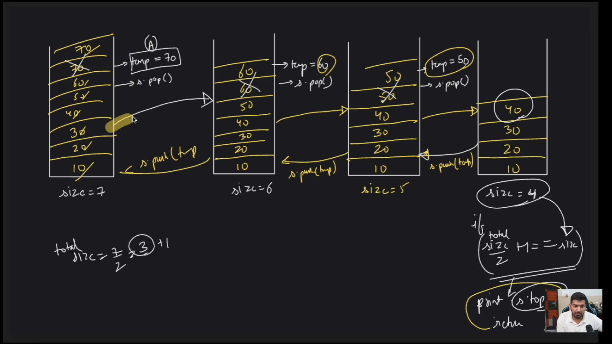
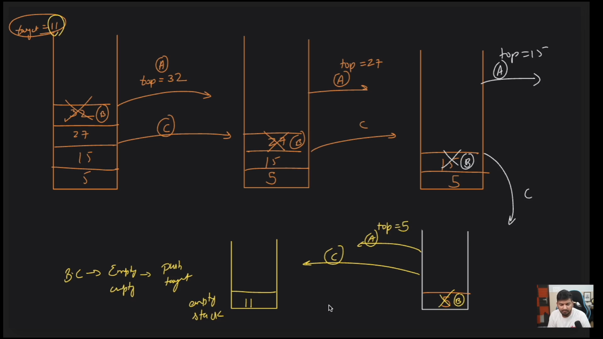
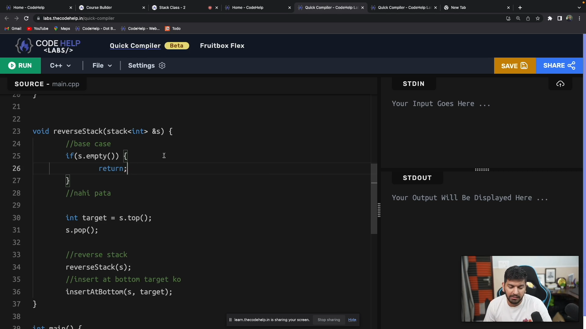
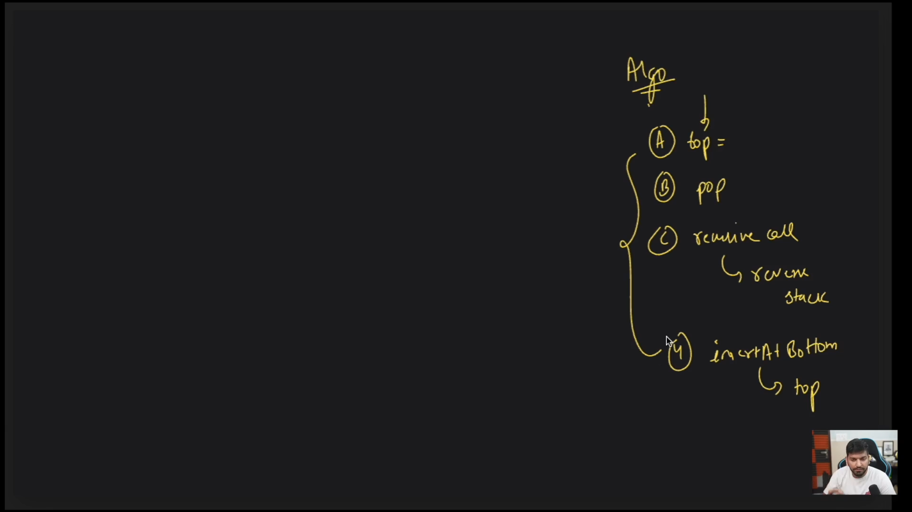
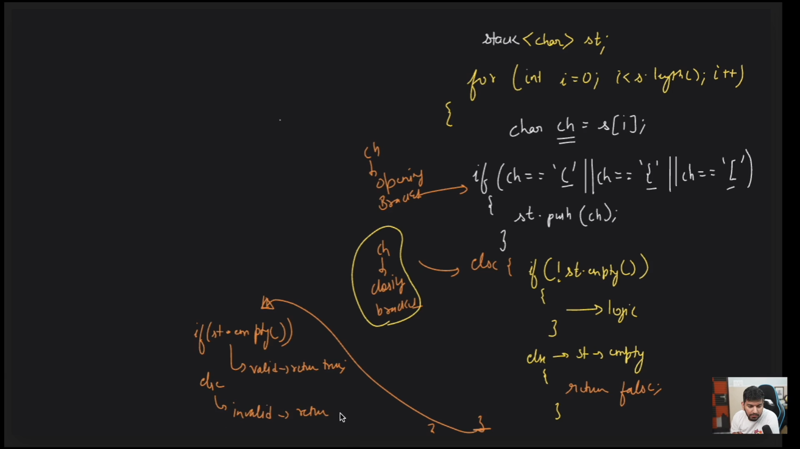
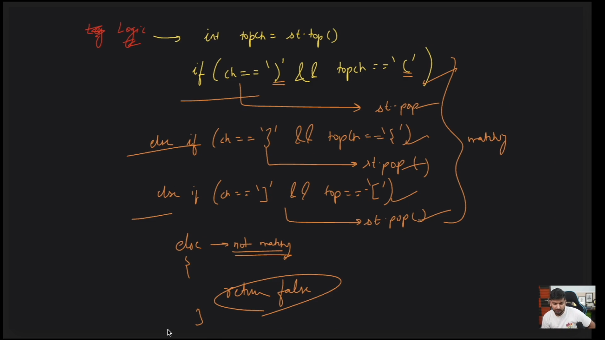

# Stack
Stack is a data structure which follows the LIFO (Last In First Out) principle. 

## Operations
1. Push(s.push(value)): Add an element to the top of the stack.
2. Pop(s.pop()): Remove the top element from the stack.
3. Peek(s.peek()): Return the top element of the stack.
4. isEmpty(s.isEmpty()): Return true if the stack is empty, false otherwise.
5. Size(s.size()): Return the number of elements in the stack.

### Find the middle element of the stack without removing the other elements


```cpp
int findMiddleElement(stack<int> &s, int size, int middle) {
    if (size <= middle) {
        return s.top();
    }
    int temp = s.top();
    s.pop();
    size--;

    // Recursive call
    int middleElement = findMiddleElement(s, size, middle);

    // Backtracking
    s.push(temp);

    return middleElement;
}
```


### Insert the upper most element at the end of the stack


```cpp
#include <bits/stdc++.h>
using namespace std;

void inserAtEnd(stack<int> &s, int target) {
    if (s.empty()) {
        s.push(target);
        return;
    }
    int temp = s.top();
    s.pop();
    inserAtEnd(s, target);

    // backtrack
    s.push(temp);
}

int main() {
    stack<int> s;
    s.push(1);
    s.push(2);
    s.push(3);
    s.push(4);
    s.push(5);

    int target = s.top();
    s.pop();
    inserAtEnd(s, target);

    // Print stack to verify
    while (!s.empty()) {
        cout << s.top() << " ";
        s.pop();
    }
    cout << endl;

    return 0;
}
```
### Reverse a stack without using extra space



```cpp
void reverseStack(stack <int> &s){
    // base case
    while(s.empty()){
        return;
    }

    int temp = s.top();
    s.pop();
    reverseStack(s);
    

    inserAtEnd(s);
}
```

### Valid Parentheses (vvvvvvvvvv important)
10000 baar kr krliya h ye when "(", "{", "[" are pushed in the stack, then ")", "}", "]" should be popped from the stack, so at the end of the string, stack should be empty.



