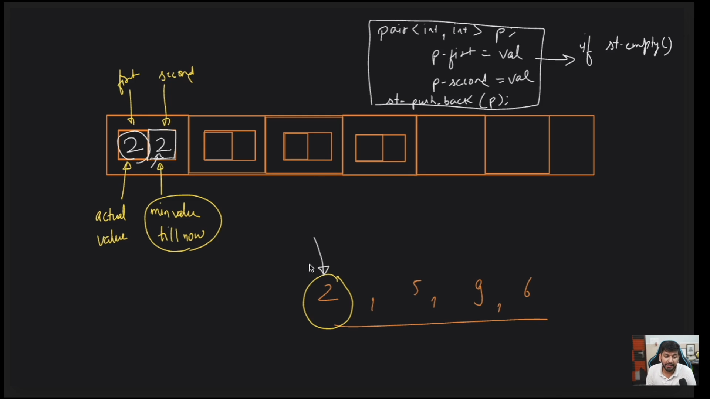

# Stack
Stack is a data structure which follows the LIFO (Last In First Out) principle. 

## Operations
1. Push(s.push(value)): Add an element to the top of the stack.
2. Pop(s.pop()): Remove the top element from the stack.
3. Peek(s.peek()): Return the top element of the stack.
4. isEmpty(s.isEmpty()): Return true if the stack is empty, false otherwise.
5. Size(s.size()): Return the number of elements in the stack.

### Find the middle element of the stack without removing the other elements


```cpp
int findMiddleElement(stack<int> &s, int size, int middle) {
    if (size <= middle) {
        return s.top();
    }
    int temp = s.top();
    s.pop();
    size--;

    // Recursive call
    int middleElement = findMiddleElement(s, size, middle);

    // Backtracking, jo cheez nikali h vo vapas daal
    s.push(temp);

    return middleElement;
}
```


### Insert the upper most element at the end of the stack / bottom of the stack


```cpp
#include <bits/stdc++.h>
using namespace std;

void inserAtEnd(stack<int> &s, int target) {
    if (s.empty()) {
        s.push(target);
        return;
    }
    int temp = s.top();
    s.pop();
    inserAtEnd(s, target);

    // backtrack
    s.push(temp);
}

int main() {
    stack<int> s;
    s.push(1);
    s.push(2);
    s.push(3);
    s.push(4);
    s.push(5);

    int target = s.top();
    s.pop();
    inserAtEnd(s, target);

    // Print stack to verify
    while (!s.empty()) {
        cout << s.top() << " ";
        s.pop();
    }
    cout << endl;

    return 0;
}
```
### Reverse a stack without using extra space


```cpp
void reverseStack(stack <int> &s){
    // base case
    while(s.empty()){
        return;
    }

    int temp = s.top();
    s.pop();
    reverseStack(s);
    

    inserAtEnd(s);
}
```

### Valid Parentheses (vvvvvvvvvv important)
10000 baar kr krliya h ye when "(", "{", "[" are pushed in the stack, then ")", "}", "]" should be popped from the stack, so at the end of the string, stack should be empty.


### Video 3 and 4



```cpp
    // question implement a stack that performs all the basic operations + find min in constant time complexity


    // im implementing only to get the things right for the min element 

    pair<int, int> p1;
    vector<pair<int, int>> v;
    // while inserting i need to check the previous min element and update the min

    int min = INT_MAX; // inital condition

    if(min>input){
        min = input;
    }

    v.push_back(pair<int, int>(input, min));

    // while popping i need to update the min element

    v.pop_back();

    if(v.back().second == min){
        min = v.back().second;
    }


    // else what we can do directly compare the elements , this will elemnicate the extra step to update the min

    // if the stack or the vector is empty then the min element will be the input element, directly insert the element in the vector, after that start comparing the elements with v.back*().second and thhen update the min element accordingly

    // while popping the element, if the element is the min element then update the min element by comparing the elements with v.back().second

```

### longest valid parentheses


Problem Statement: Given a string containing just the characters '(' and ')', find the length of the longest valid (well-formed) parentheses substring.

Example 1: Input: s = "(()" Output: 2 Explanation: The longest valid parentheses substring is "()".

Example 2: Input: s = ")()())" Output: 5 Explanation: The longest valid parentheses substring is "()()".


### Approach

1. Create a stack and push -1 into the stack, this will ensure that the stack is not empty. 
2. Traverse the string and if the character is '(' then push the index into the stack.
3. If the character is ')' then pop the top element from the stack. and then check if the stack is empty or not. If the stack is empty then push the index into the stack.
4. If the stack is not empty then calculate the length of the valid substring by subtracting the current index with the top element of the stack.

formula for length = current index - top element of the stack.

```cpp

class Solution {
public:
    int longestValidParentheses(string s) {
        // initially the index is 0;
        int index = 0;
        stack<int> st;
        st.push(-1);
        int ans = 0;

        int size = s.size();

        for(int i=0;i<size;i++){
            if(s[i]== '('){
                st.push(i);
            }
            if(s[i] == ')'){
                st.pop();
            }

            if(!st.empty()){
                int calculation;
                calculation = i-st.top();
                ans = max(ans, calculation);
            }
            if(st.empty()){
                st.push(i);
            }
            
        }
        return ans;
    }
};

```

## Next min element 

Problem Statement: Find the next min element within the array, if the next min element is not present then return -1.

Example 1: Input: [4, 5, 2, 10, 8] Output: [2, 2, -1, 8, -1]

### Approach 1
1. Consider each element one by one and then try to find next element which is smaller than the current element, by traversing the entire remaining array.
2. If the next min element is found then push it into the stack, else push -1 into the stack.

```cpp

vector<int> nextMinElement(vector<int> &v){
    stack<int> st;
    int size = v.size();
    vector<int> ans(size);

    for(int i=0;i<size;i++){
        int j;
        for(j=i+1;j<size;j++){
            if(v[j]<v[i]){
                st.push(v[j]);
                break;
            }
        }
        if(j==size){
            st.push(-1);
        }
    }

    for(int i=0;i<size;i++){
        ans[i] = st.top();
        st.pop();
    }

    return ans;
}

```

### Approach 2
Change the approach instead of left to right traversal, do the right to left traversal.

